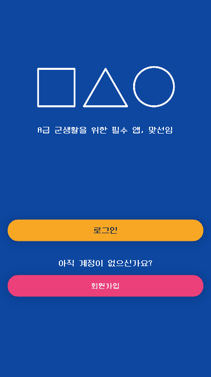
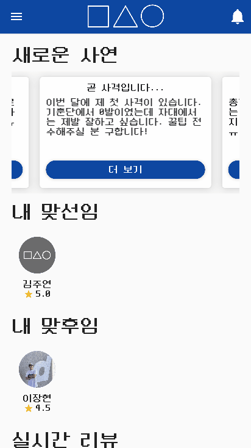
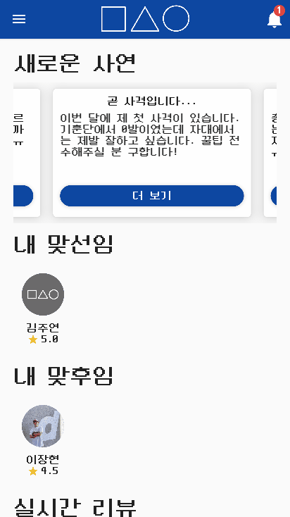
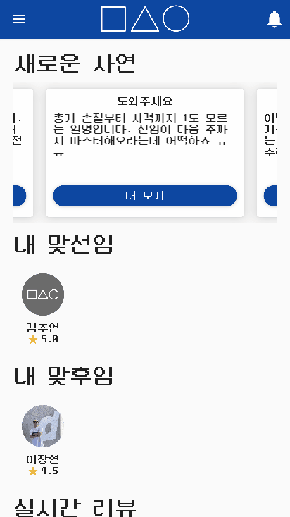
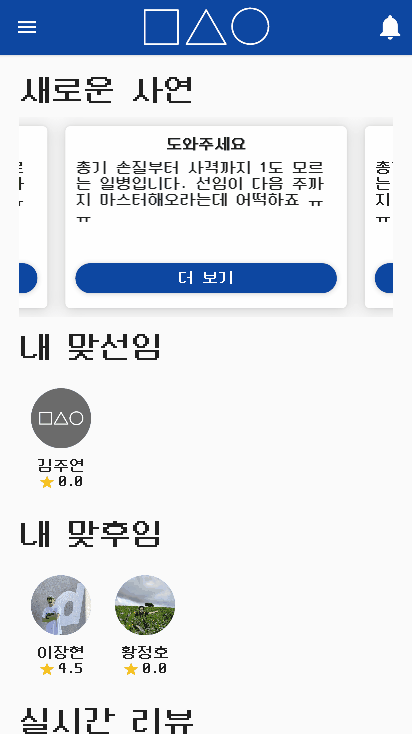
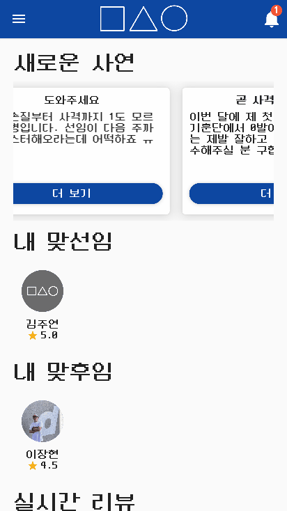

<div align="center">


[](https://github.com/osamhack2021/APP_Matseonim_CupHoldings/releases/download/v0.1.1/matseonim-v0.1.1-armeabi-v7a-release.apk)

[](https://github.com/osamhack2021/APP_Matseonim_CupHoldings/blob/main/LICENSE)
[](https://github.com/osamhack2021/APP_Matseonim_CupHoldings/actions)
[](https://www.codefactor.io/repository/github/osamhack2021/app_matseonim_cupholdings)
[](https://github.com/osamhack2021/APP_Matseonim_CupHoldings/pulse)
  
군생활 중 특정 분야에 도움이 필요할 때 마치 맞선임 같은 전문가를 매칭시켜주는 플랫폼.  
'맞선임'은 A급 군생활을 위한 필수 앱입니다.

[앱 소개](#앱-소개) •
[주요 기능](#주요-기능) •
[필수 조건](https://github.com/osamhack2021/APP_Matseonim_CupHoldings/wiki/%ED%95%84%EC%88%98-%EC%A1%B0%EA%B1%B4) •
[빌드 방법](https://github.com/osamhack2021/APP_Matseonim_CupHoldings/wiki/%EC%95%B1-%EB%B9%8C%EB%93%9C%ED%95%98%EA%B8%B0) •
[개발 문서](https://github.com/osamhack2021/APP_Matseonim_CupHoldings/wiki) •
[기술 스택](#기술-스택)

</div> <br />

# 앱 소개

건장한 군장병이라면 누구나 A급 군생활을 꿈꿉니다. 

하지만 P급이 되는 길은 쉬워도 A급이 되기 위한 길은 멀고도 험합니다. 총기손질과 사격, 화생방 보호의 착용법 등을 완벽히 숙지해야하고, 제초나 시멘트칠, 페인트칠 등의 전문 기술도 마스터해야 합니다. 어디 그뿐입니까. 자대생활을 잘하기 위해서는 축구와 풋살 등의 스포츠에도 능숙해야 합니다.

사회에서는 상상도 경험도 못했던 이런 일들을 처음부터 잘하는 사람은 극히 드뭅니다.

이럴 때 소위 “짬에서 나오는 바이브”를 가진 전문가들에게 도움과 가르침을 얻으면 어떨까요?

맞선임은 군생활 중 특정 분야에 도움이 필요한 사람들을 위한 전문가 매칭 플랫폼으로, 마치 "맞선임"처럼 열정적이고 친절하게 자신의 전문 분야나 특기와 관련된 지식으로 여러분을 가르쳐주기도 하고, 의뢰를 적극적으로 해결해주는 사람을 찾아주는 서비스입니다. 저희 서비스의 테마에 맞게 전문가는 "맞선임", 요청자는 "맞후임"으로 불리고 있습니다.

백문이 불여일견. 아래를 클릭하여 영상과 프레젠테이션부터 보고 가시죠!

| 소개 영상 | PPT |
| ------- | --- |
|[](https://youtu.be/HfG5JgnUkIw)| [](https://shorturl.at/nqrzA)|

# 주요 기능

## 회원가입

계정 정보를 입력하고 소속 부대, 전문 분야와 관심 분야를 선택하면 회원가입이 완료됩니다.



## 의뢰 요청

새로운 의뢰를 요청하는 기능입니다.<br>제목, 내용과 의뢰 분야를 작성하여 제출하면 사용자가 속한 부대의 전문가들이 의뢰를 확인할 수 있습니다.



## 전문가 매칭

의뢰를 수락하면 의뢰를 요청한 사람과 의뢰를 수락한 사람이 “맞선임”&mdash;“맞후임” 관계를 맺게 됩니다.



## 실시간 채팅

“맞선임”&mdash;“맞후임” 관계를 맺은 사람들끼리 실시간 채팅을 통하여 의뢰의 세부 사항을 조율할 수 있습니다.



## 리뷰 및 평점

다른 사용자에게 평점을 매기고 리뷰를 작성할 수 있습니다.<br>사용자 프로필의 평균 평점과 리뷰는 실시간으로 업데이트됩니다.



## 알림 페이지

맞선임과 매칭이 되었거나 채팅방에 새로운 메시지 <br>또는 리뷰가 작성되면 앱에서 알림을 받을 수 있습니다.



# 기대 효과 및 전망

군에는 신기하게도 자타공인 “전문가”들이 많이 숨어있습니다. 사격 만발자, 제초 전문가, 공구리 마스터 등의 군생활 전문가 뿐만 아니라 토익 만점자, 물리치료사, 풋살 신동, 각종 석·박사 등 사회에서 이름을 날릴 만한 여러 전문가들이 있습니다. 이런 인재들을 그냥 썩히기는 너무 아깝습니다.

저희 맞선임 서비스는 군생활에 관련된 능력 뿐만 아니라, 학업, 스포츠 등 모든 분야의 전문가들을 매칭할 수 있어 가능성이 무궁무진합니다. "맞선임"에게 과외를 받아도 되고, 도움이 필요한 일에 대해 단순 의뢰를 요청할 수도 있습니다. 예를 들어서 사격에서 고득점을 받고 싶다면 부대의 진종오, 헬스 꿀팁을 전수 받고 싶다면 부대의 로니 콜먼, 영어 1등급을 목표로 한다면 부대의 최고 어학병 등과 매칭 신청을 할 수 있습니다. 전문가들 또한 군생활동안 자신의 특기를 뽐내고 전수하다 보면 경력 단절을 예방할 수 있을 뿐만 아니라 자신의 능력을 더욱 발전시킬 수 있어, 모두가 풍요로운 병영생활을 할 수 있을 것 입니다.

저희 맞선임 서비스는 최종적으로 국방부와 협업하여 운영하는 것을 목표로 하고 있습니다. 수업을 잘 따라가는 맞후임, 의뢰를 열정적으로 수행하는 맞선임 등의 우수 참여자들에게는 포상휴가, 가점이나 보조금 등의 인센티브를 부여하면 수요와 공급이 모두 잡히고 서비스를 원활하게 운영할 수 있을 것입니다.

# 필수 조건 및 빌드 방법

필수 조건과 안드로이드 앱, 웹 앱으로의 빌드 방법은 ['맞선임' 공식 개발 문서](https://github.com/osamhack2021/APP_Matseonim_CupHoldings/wiki)를 참고해주시기 바랍니다.

# 기술 스택

## 프론트엔드

- [Dart 2.14.0 (stable)](https://github.com/dart-lang/sdk/commit/4c8a4f0d7ad055fa7dea5e80862cd2074f4454d3)
- [Flutter 2.5.0 (stable)](https://github.com/flutter/flutter/commit/4cc385b4b84ac2f816d939a49ea1f328c4e0b48e)

### [플러그인](https://github.com/osamhack2021/APP_Matseonim_CupHoldings/blob/main/APP(Android)/pubspec.yaml)

- [`cached_network_image: ^3.1.0`](https://pub.dev/packages/cached_network_image)
- [`carousel_slider: ^4.0.0`](https://pub.dev/packages/carousel_slider)
- [`cloud_firestore: ^2.5.3`](https://pub.dev/packages/cloud_firestore)
- [`cupertino_icons: ^1.0.2`](https://pub.dev/packages/cupertino_icons)
- [`get: ^4.3.8`](https://pub.dev/packages/get)
- [`image_picker: ^0.8.4+2`](https://pub.dev/packages/image_picker)
- [`firebase_auth: ^3.1.1`](https://pub.dev/packages/firebase_auth)
- [`firebase_core: ^1.6.0`](https://pub.dev/packages/firebase_core)
- [`firebase_storage: ^10.0.4`](https://pub.dev/packages/firebase_storage)
- [`flutter_chat_ui: ^1.4.4`](https://pub.dev/packages/flutter_chat_ui)
- [`flutter_launcher_icons: ^0.9.2`](https://pub.dev/packages/flutter_launcher_icons)
- [`flutter_rating_bar: ^4.0.0`](https://pub.dev/packages/flutter_rating_bar)
- [`flutter_typeahead: ^3.2.1`](https://pub.dev/packages/flutter_typeahead)
- [`validators: ^3.0.0`](https://pub.dev/packages/validators)

## 백엔드

- [Firebase](https://firebase.google.com/?hl=en)

## CI/CD

- [GitHub Actions](https://docs.github.com/en/actions)

# 팀원 정보

<table>
 <tr>
  <td align='center'>이름</td>
  <td align='center'>계급</td>
  <td align='center'>역할</td>
  <td align='center'>GitHub</td>
  <td align='center'>E-Mail</td>
 </tr>
   
 <tr>
  <td align='center'>황정호</td>
  <td align='center'>공군 상병</td>
  <td align='center'>팀장<br>프론트엔드</td>
  <td align='center'><a href="https://github.com/jhhwang21c">GitHub</a></td>
  <td align='center'>h.jungho21c@gmail.com</td>
 </tr>

 <tr>
  <td align='center'>김재덕</td>
  <td align='center'>공군 병장</td>
  <td align='center'>백엔드</td>
  <td align='center'><a href="https://github.com/jdeokkim">GitHub</a></td>
  <td align='center'>jdeokkim@protonmail.com</td>
 </tr>
</table>

# 라이선스

```
Copyright (c) 2021 John Hwang (@jhhwang21c) and Jaedeok Kim (@jdeokkim)

Permission is hereby granted, free of charge, to any person obtaining a copy
of this software and associated documentation files (the "Software"), to deal
in the Software without restriction, including without limitation the rights
to use, copy, modify, merge, publish, distribute, sublicense, and/or sell
copies of the Software, and to permit persons to whom the Software is
furnished to do so, subject to the following conditions:

The above copyright notice and this permission notice shall be included in all
copies or substantial portions of the Software.

THE SOFTWARE IS PROVIDED "AS IS", WITHOUT WARRANTY OF ANY KIND, EXPRESS OR
IMPLIED, INCLUDING BUT NOT LIMITED TO THE WARRANTIES OF MERCHANTABILITY,
FITNESS FOR A PARTICULAR PURPOSE AND NONINFRINGEMENT. IN NO EVENT SHALL THE
AUTHORS OR COPYRIGHT HOLDERS BE LIABLE FOR ANY CLAIM, DAMAGES OR OTHER
LIABILITY, WHETHER IN AN ACTION OF CONTRACT, TORT OR OTHERWISE, ARISING FROM,
OUT OF OR IN CONNECTION WITH THE SOFTWARE OR THE USE OR OTHER DEALINGS IN THE
SOFTWARE.
```

```
Copyright © 2017-2021, Eunbin Jeong (Dalgona.) <project-neodgm@dalgona.dev>
with reserved font name "Neo둥근모" and "NeoDunggeunmo".
```
